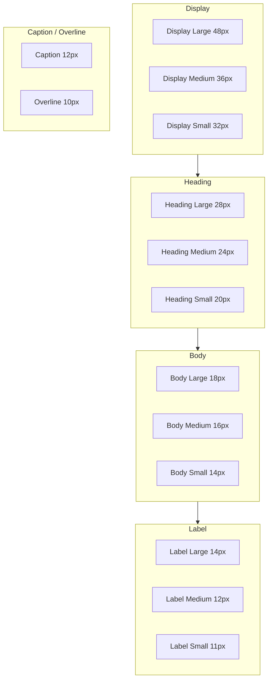

# Editai — Design System

Documento de referência do design system do Editai para uso no site, identidade visual e consistência entre plataformas.

---

## 1. Identidade da Marca

| Atributo | Valor |
|----------|-------|
| **Nome** | Editai |
| **Descrição** | App de edição de fotos com IA |
| **Tagline** | Seu estúdio de edição com IA |
| **Ícone principal** | Varinha mágica / IA (`auto_fix_high`) |
| **Tom de voz** | Profissional, criativo, acessível |

---

## 2. Paleta de Cores

### Cores primárias

| Nome | Hex | RGB | Uso |
|------|-----|-----|-----|
| Primary | `#3B82F6` | rgb(59, 130, 246) | CTAs, links, destaques |
| Primary Dark | `#2563EB` | rgb(37, 99, 235) | Hover, estados ativos |
| Primary Light | `#60A5FA` | rgb(96, 165, 250) | Estados secundários |

### Fundos

| Nome | Hex | RGB | Uso |
|------|-----|-----|-----|
| Background Light | `#F8FAFC` | rgb(248, 250, 252) | Fundo modo claro |
| Background Dark | `#0F172A` | rgb(15, 23, 42) | Fundo modo escuro |
| Background Dark Secondary | `#1E293B` | rgb(30, 41, 59) | Fundos secundários dark |

### Texto

| Nome | Hex | RGB | Uso |
|------|-----|-----|-----|
| Text Primary | `#1E293B` | rgb(30, 41, 59) | Títulos, corpo principal |
| Text Secondary | `#64748B` | rgb(100, 116, 139) | Subtítulos |
| Text Tertiary | `#94A3B8` | rgb(148, 163, 184) | Hints, desabilitado |
| Text Light | `#FFFFFF` | rgb(255, 255, 255) | Texto em fundos escuros |

### Superfícies

| Nome | Hex | RGB | Uso |
|------|-----|-----|-----|
| Surface Light | `#FFFFFF` | rgb(255, 255, 255) | Cards, inputs (modo claro) |
| Surface Dark | `rgba(255,255,255,0.05)` | — | Cards (modo escuro) |
| Surface Dark Secondary | `rgba(255,255,255,0.10)` | — | Superfícies secundárias dark |

### Bordas

| Nome | Hex | RGB | Uso |
|------|-----|-----|-----|
| Border | `#E2E8F0` | rgb(226, 232, 240) | Divisores, bordas (modo claro) |
| Border Dark | `#334155` | rgb(51, 65, 85) | Bordas (modo escuro) |

### Status

| Nome | Hex | RGB | Uso |
|------|-----|-----|-----|
| Success | `#10B981` | rgb(16, 185, 129) | Confirmações, sucesso |
| Warning | `#F59E0B` | rgb(245, 158, 11) | Alertas, avisos |
| Error | `#EF4444` | rgb(239, 68, 68) | Erros, crítico |
| Info | `#3B82F6` | rgb(59, 130, 246) | Informações |

### Overlay

| Nome | Hex | Uso |
|------|-----|-----|
| Overlay | `rgba(0,0,0,0.5)` | Overlays escuros |
| Overlay Light | `rgba(0,0,0,0.25)` | Overlays leves |

---

## 3. Tipografia

**Fonte**: [Space Grotesk](https://fonts.google.com/specimen/Space+Grotesk) (Google Fonts)

### Hierarquia



### Escala completa

| Estilo | Tamanho | Peso | Letter-spacing | Line-height |
|--------|---------|------|----------------|-------------|
| Display Large | 48px | Bold (700) | -0.02 | 1.2 |
| Display Medium | 36px | Bold (700) | -0.02 | 1.2 |
| Display Small | 32px | Bold (700) | -0.015 | 1.2 |
| Heading Large | 28px | Bold (700) | -0.015 | 1.3 |
| Heading Medium | 24px | Bold (700) | -0.015 | 1.3 |
| Heading Small | 20px | Bold (700) | -0.01 | 1.4 |
| Body Large | 18px | Normal (400) | 0 | 1.5 |
| Body Medium | 16px | Normal (400) | 0 | 1.5 |
| Body Small | 14px | Normal (400) | 0 | 1.5 |
| Label Large | 14px | Medium (500) | 0.1 | 1.4 |
| Label Medium | 12px | Medium (500) | 0.1 | 1.4 |
| Label Small | 11px | Medium (500) | 0.1 | 1.4 |
| Caption | 12px | Normal (400) | 0.4 | 1.4 |
| Overline | 10px | Bold (700) | 1.5 | 1.4 |

---

## 4. Sistema de Espaçamento

Padrões extraídos do código:

| Unidade | Valor | Uso |
|---------|-------|-----|
| Base | 4px | Unidade mínima |
| 4 | 4px | Gaps entre label e valor |
| 6 | 6px | Gaps em badges |
| 8 | 8px | Gaps internos pequenos |
| 12 | 12px | Gaps entre cards, ícone-texto |
| 16 | 16px | Padding padrão, gaps entre seções |
| 18 | 18px | Padding de HeroActionCard |
| 20 | 20px | Padding de PlanCard |
| 24 | 24px | Padding de página, gaps grandes |
| 32 | 32px | Espaçamento entre blocos |
| 48 | 48px | Espaçamento antes de formulários |
| 64 | 64px | Espaçamento antes de logo/título |

### Padding de página

- Horizontal: 16–24px
- Vertical: 12–24px

### Gaps entre elementos

- Entre seções: 16–32px
- Entre cards: 12–16px
- Entre itens de lista: 8–12px

---

## 5. Border Radius

| Nome | Valor | Uso |
|------|-------|-----|
| Pequeno | 8px | Badges, chips, ícones pequenos |
| Médio | 12px | Botões, cards, inputs, UploadArea |
| Grande | 16px | AppCard |
| Extra grande | 20px | HeroActionCard |
| Pill | 9999px | CreditIndicator, badges circulares |

---

## 6. Sombras

| Componente | Blur | Offset | Cor | Opacidade |
|------------|------|--------|-----|-----------|
| Card padrão (light) | 18px | (0, 8) | black | 6% |
| Card padrão (dark) | 18px | (0, 8) | black | 25% |
| Botão primário | 8px | — | primary | 30% |
| Card destacado (PlanCard) | 20px | — | primary | 10% |
| Logo login | 20px | — | primary | 30% |
| Tab selecionado | 4px | — | black | 5% |

---

## 7. Componentes

### AppButton

- **Altura**: 56px (padrão)
- **Border radius**: 12px
- **Variantes**: Primary (filled), Outline (borda)
- **Cor primária**: primary (background)
- **Cor outline**: primary (borda 1.5px)
- **Texto**: Label Large, bold
- **Ícone**: 20px, opcional

### AppCard

- **Border radius**: 16px
- **Borda**: 1px (border ou borderDark)
- **Padding**: 16px (padrão)
- **Cor**: surfaceLight / surfaceDark

### PlanCard

- **Border radius**: 12px
- **Borda**: 1px normal, 2px quando destacado
- **Padding**: 20px
- **Cor destacada**: 2px primary, sombra primary 10%

### UploadArea

- **Border radius**: 12px
- **Borda**: 2px (primary 40%)
- **Ícone**: 80px círculo, primary 10% background
- **Padding**: 48px vertical, 24px horizontal (vazio)

### CreditIndicator

- **Formato**: Pill (border-radius 9999px)
- **Padding**: 12px horizontal, 6px vertical
- **Cores dinâmicas**: Error (≤3 créditos), Warning (≤10), Primary (>10)
- **Ícone**: bolt, 16px

### HeroActionCard

- **Border radius**: 20px
- **Padding**: 18px
- **Ícone**: 52px círculo com gradiente primary (22% → 6%)
- **Sombra**: blur 18px, offset (0, 8)

### AppTextField

- **Padding**: 16px horizontal, 16px vertical
- **Label**: Label Medium, bold
- **Texto**: Body Large

---

## 8. Ícones

| Categoria | Ícone | Uso |
|-----------|-------|-----|
| **Principal** | `auto_fix_high` | Logo, IA, marca |
| **Créditos** | `bolt` | Saldo, energia |
| **Edição** | `edit` | Editar imagem |
| **Texto** | `text_fields` | Texto para imagem |
| **Coleção** | `collections` | Unir fotos |
| **Fundo** | `wallpaper` | Remover fundo |
| **Upload** | `add_photo_alternate` | Selecionar imagem |
| **Navegação** | `arrow_back_ios_new` | Voltar |
| **Navegação** | `arrow_forward_ios_rounded` | Avançar |
| **Status** | `check_circle` | Sucesso |
| **Status** | `schedule` | Pendente |
| **Status** | `cancel` | Falhou |
| **Status** | `replay` | Reembolsado |
| **Premium** | `workspace_premium` | Plano atual |

---

## 9. Modo Escuro

Mapeamento de cores light → dark:

| Modo claro | Modo escuro |
|------------|-------------|
| backgroundLight | backgroundDark |
| surfaceLight | surfaceDark |
| textPrimary | textLight |
| textSecondary | textTertiary |
| textTertiary | textTertiary |
| border | borderDark |

---

## 10. Tokens CSS (Web)

```css
:root {
  /* Primary */
  --color-primary: #3B82F6;
  --color-primary-dark: #2563EB;
  --color-primary-light: #60A5FA;

  /* Background */
  --color-bg-light: #F8FAFC;
  --color-bg-dark: #0F172A;

  /* Text */
  --color-text-primary: #1E293B;
  --color-text-secondary: #64748B;
  --color-text-tertiary: #94A3B8;
  --color-text-light: #FFFFFF;

  /* Surface */
  --color-surface-light: #FFFFFF;
  --color-surface-dark: rgba(255, 255, 255, 0.05);

  /* Border */
  --color-border: #E2E8F0;
  --color-border-dark: #334155;

  /* Status */
  --color-success: #10B981;
  --color-warning: #F59E0B;
  --color-error: #EF4444;

  /* Spacing */
  --spacing-4: 4px;
  --spacing-8: 8px;
  --spacing-12: 12px;
  --spacing-16: 16px;
  --spacing-24: 24px;
  --spacing-32: 32px;

  /* Radius */
  --radius-sm: 8px;
  --radius-md: 12px;
  --radius-lg: 16px;
  --radius-xl: 20px;

  /* Typography */
  --font-family: 'Space Grotesk', sans-serif;
}
```

---

## 11. Uso no Site

### Recomendações

1. **Hero**: Display Medium ou Display Small para título principal
2. **CTAs**: Botão primary com altura mínima 48px
3. **Cards**: Border radius 12–16px, sombra leve
4. **Links**: Cor primary, Label Medium ou Body Medium bold
5. **Formulários**: AppTextField com padding 16px
6. **Badges**: Pill ou radius 8px, com cores de status

### Import Google Fonts

```html
<link rel="preconnect" href="https://fonts.googleapis.com">
<link rel="preconnect" href="https://fonts.gstatic.com" crossorigin>
<link href="https://fonts.googleapis.com/css2?family=Space+Grotesk:wght@400;500;600;700&display=swap" rel="stylesheet">
```

---

## Referências

- Cores: `lib/core/theme/app_colors.dart`
- Tipografia: `lib/core/theme/app_text_styles.dart`
- Componentes: `lib/core/widgets/`
- Home: `lib/features/home/presentation/pages/home_page.dart`
- Login: `lib/features/auth/presentation/pages/login_page.dart`
