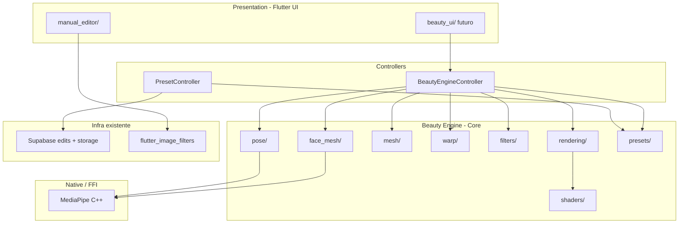
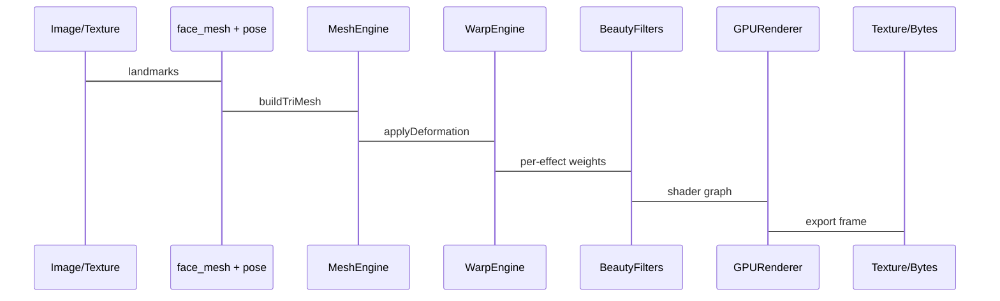

# Beauty Engine — Arquitetura

## Plataformas

Target **exclusivo: iOS + Android** (app nativo). Sem Web, Desktop ou outras plataformas Flutter.

## Princípios

1. **Desacoplamento total da UI** — o engine expõe APIs; telas Flutter consomem via controllers
2. **Uma malha, muitos efeitos** — Mesh Engine central; filtros não duplicam triangulação
3. **GPU-first** — preview e export no GPU; CPU só para orquestração e I/O
4. **Open source only** — sem Tencent, Banuba, FaceUnity, IMG.LY
5. **Extensível** — warp MLS hoje; interface pronta para TPS, ARAP, mesh warp

## Estrutura de pastas

```
lib/features/editor/
├── manual_editor/          # Fase 1 — entrega atual (inalterada)
│   ├── data/
│   └── presentation/
│
└── beauty_engine/          # Fase 2+ — motor reutilizável
    ├── face_mesh/          # Detecção + landmarks faciais
    ├── pose/               # Detecção corporal (33 landmarks)
    ├── mesh/               # Malha triangulada compartilhada
    ├── warp/               # MLS, TPS (futuro), ARAP (futuro)
    ├── shaders/            # GLSL/SPIR-V para skin, LUT, blend
    ├── presets/            # LUT + Beauty preset models e repo
    ├── filters/            # Implementações por efeito (face_slim, waist, etc.)
    ├── rendering/          # Pipeline GPU, textures, FBO
    ├── controllers/        # Orquestração stateless (sem Widget)
    └── models/             # DTOs: Landmark, Mesh, WarpParams, Preset, Frame
```

## Diagrama de camadas



## Pipeline de processamento



## Contratos principais (interfaces)

```dart
/// Detecção — sem UI
abstract class FaceMeshDetector {
  Future<FaceMeshResult?> detect(ImageSource source);
}

abstract class PoseDetector {
  Future<PoseResult?> detect(ImageSource source);
}

/// Malha compartilhada
abstract class MeshEngine {
  TriMesh buildFaceMesh(FaceMeshResult face, Size imageSize);
  TriMesh buildBodyMesh(PoseResult pose, Size imageSize);
  TriMesh merge(TriMesh face, TriMesh body);
}

/// Warp desacoplado
abstract class WarpEngine {
  WarpField compute(WarpRequest request); // MLS default
  Texture apply(Texture input, WarpField field, GPURenderer renderer);
}

/// Filtro individual — composável
abstract class BeautyFilter {
  String get id;
  void apply(FilterContext ctx); // lê mesh + warp + shaders
}

/// Orquestrador — ponto único para UI
class BeautyEngineController {
  Future<ProcessedFrame> process(ProcessingPipeline pipeline);
  Stream<ProcessedFrame> processStream(CameraFrame frame); // tempo real futuro
}
```

## Integração com Manual Editor

O Manual Editor **não importa** `beauty_engine/` na Fase 1.

Integração futura (Sprint 21+):
- Manual Editor pode chamar `BeautyEngineController` como camada extra antes do export
- Ou tela dedicada `BeautyEditorPage` consome o mesmo controller
- Persistência continua via `salvar-edicao-manual` / `operation_type = manual_edit` ou novo tipo `beauty_edit`

## Desacoplamento UI ↔ Engine

| Permitido | Proibido |
|-----------|----------|
| Controller recebe `Uint8List` / `Texture` | Filter importar `material.dart` |
| Callbacks `onProgress`, `onFrame` | Engine navegar rotas |
| Presets como JSON serializável | Engine chamar Supabase diretamente (usar repository injetado) |

## ADRs (Architecture Decision Records)

Decisões aprovadas na **Sprint 01**:

| ADR | Título |
|-----|--------|
| [adr/001-beauty-engine-boundaries.md](./adr/001-beauty-engine-boundaries.md) | Fronteiras Manual Editor ↔ Beauty Engine |
| [adr/002-mediapipe-ffi-strategy.md](./adr/002-mediapipe-ffi-strategy.md) | FFI MediaPipe Android → iOS |
| [adr/003-dependency-injection.md](./adr/003-dependency-injection.md) | Riverpod providers |

Índice: [adr/README.md](./adr/README.md) · Sign-off: [sprint-01-signoff.md](./sprint-01-signoff.md)
