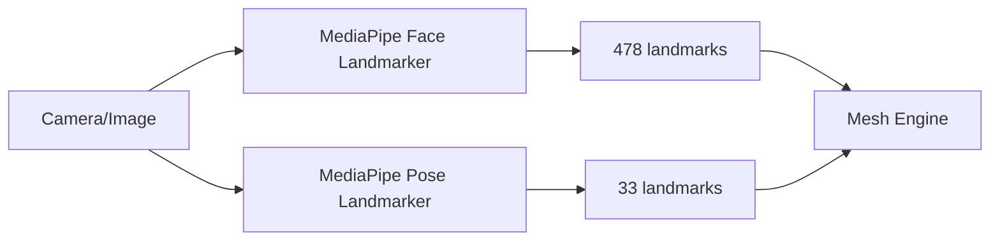

# MediaPipe — Face Mesh e Pose

## Face Mesh (478 landmarks)

### Objetivo
Detectar rosto em tempo real com **478 landmarks 3D** para warp facial preciso.

### Plataformas alvo (somente nativo)

O app publica **apenas iOS e Android** — não há Web/Desktop.

| Plataforma | Prioridade | Abordagem |
|------------|------------|-----------|
| **Android** | P0 | MediaPipe Tasks Vision (JNI/FFI) |
| **iOS** | P0 | MediaPipe Tasks Vision (CocoaPods/FFI) |

Ambas as plataformas são **obrigatórias** desde o Sprint 03 (Face Mesh) e Sprint 04 (Pose). Não planejar WASM, WebGL ou builds desktop.

### Integração Flutter

**Opção principal:** FFI para `mediapipe/tasks/cc/vision/face_landmarker`

**Fallback exploratório:** `google_mlkit_face_mesh_detection` (beta, Android-only, 468 pts) — usar só enquanto FFI não estiver pronto; normalizar para 478 via interpolação.

### Output model (`face_mesh/models/`)

```dart
class FaceLandmark {
  final int index;
  final Offset normalized; // 0..1
  final double z;
  final double visibility;
}

class FaceMeshResult {
  final List<FaceLandmark> landmarks; // 478
  final Rect boundingBox;
  final double confidence;
  final Matrix4? transformMatrix; // opcional
}
```

### Regiões derivadas (índices MediaPipe)

| Região | Uso |
|--------|-----|
| Contorno facial | Face slim, V face |
| Mandíbula | Jaw, chin |
| Olhos | Eye scale, distance, rotation |
| Nariz | Nose slim, tip, bridge |
| Lábios | Mouth width, lip thickness |
| Sobrancelhas | Eyebrows makeup |
| Maçãs do rosto | Cheekbone |

Documentar mapa completo de índices em `face_mesh/landmark_regions.dart`.

### Tempo real

- Target: **≥ 24 FPS** preview em selfie 720p (mid-range 2022+)
- Rodar detecção em **isolate** ou thread nativa; entregar landmarks ao main isolate via `ReceivePort`
- Cache landmarks entre frames se movimento < threshold (video mode)

## Pose (33 landmarks)

### Objetivo
Detectar esqueleto corporal para filtros de cintura, pernas, braços, ombros.

### Landmarks relevantes

| Landmark | Filtros |
|----------|---------|
| Ombros (11, 12) | Shoulder width |
| Quadril (23, 24) | Hip, waist context |
| Cintura (inferida 11–12 ↔ 23–24) | Waist slim |
| Joelhos, tornozelos | Leg length, leg slim |
| Cotovelos, pulsos | Arm slim |
| Pescoço (inferido) | Neck slim |

### Output model (`pose/models/`)

```dart
class PoseLandmark {
  final int index;
  final Offset normalized;
  final double visibility;
}

class PoseResult {
  final List<PoseLandmark> landmarks; // 33
  final Rect boundingBox;
}
```

## Diagrama



## Riscos

| Risco | Mitigação |
|-------|-----------|
| MediaPipe FFI complexo | Sprint 03 dedicado; prototipo Android primeiro |
| ML Kit só Android | FFI como path principal |
| Rostos múltiplos | Selecionar maior confidence; multi-face em sprint futuro |
| Pose parcial/ocluída | visibility threshold; desabilitar body filters |

## Referências

- [MediaPipe Face Landmarker](https://developers.google.com/mediapipe/solutions/vision/face_landmarker)
- [MediaPipe Pose Landmarker](https://developers.google.com/mediapipe/solutions/vision/pose_landmarker)
