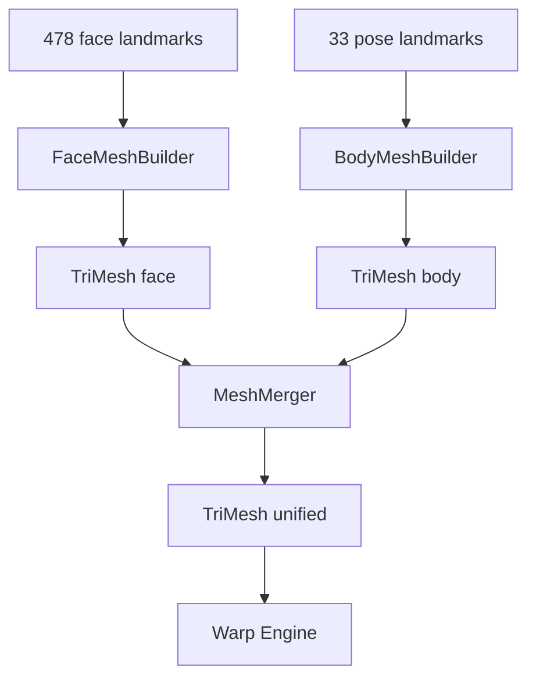

# Mesh Engine

## Objetivo

Criar **uma malha triangulada reutilizável** que serve de base para **todos** os filtros faciais e corporais. Nenhum efeito duplica lógica de triangulação.

## Localização

`lib/features/editor/beauty_engine/mesh/`

## Componentes

```
mesh/
├── models/
│   ├── tri_mesh.dart          # vertices, uvs, indices
│   ├── mesh_region.dart       # face_jaw, nose, waist_left, etc.
│   └── mesh_topology.dart     # conectividade pré-definida
├── face_mesh_builder.dart     # 478 landmarks → triângulos rosto
├── body_mesh_builder.dart     # 33 pose → triângulos torso/pernas
├── mesh_merger.dart           # merge face + body sem overlap artifacts
├── mesh_cache.dart            # cache por hash de landmarks
└── mesh_engine.dart           # facade
```

## Modelo de dados

```dart
class TriMesh {
  final Float32List vertices;   // x,y por vertex (normalized ou pixel)
  final Float32List uvs;        // coordenadas textura
  final Uint32List indices;     // índices triângulos
  final Map<MeshRegion, IndexRange> regions;
}

enum MeshRegion {
  faceOval, jawLeft, jawRight, nose, leftEye, rightEye,
  lips, leftCheek, rightCheek, forehead,
  torso, waist, leftArm, rightArm, leftLeg, rightLeg, neck,
}
```

## Algoritmo — Face

1. Receber `FaceMeshResult` (478 pts)
2. Usar topologia fixa MediaPipe FACEMESH_TESSELATION (triângulos conhecidos)
3. Mapear índices → `MeshRegion` via tabela estática
4. Subdividir regiões de alto warp (mandíbula) se necessário — Sprint 05+

## Algoritmo — Body

1. Receber `PoseResult` (33 pts)
2. Construir quad/tri mesh entre ombros–quadril–pernas
3. Regiões parametrizadas para waist slim (band entre landmarks inferidos)

## Merge face + body

- Prioridade: face mesh tem prioridade em overlap pescoço
- Blend suave na transição pescoço (vertex weights)

## Diagrama



## Cache

- Key: hash quantizado dos landmarks (evitar rebuild a cada frame idêntico)
- Invalidar em resize de imagem ou troca de foto

## Critérios de qualidade

- Sem triângulos invertidos em rosto frontal
- UVs estáveis para shader sampling
- Regiões isoláveis para warp local (jaw só move jaw)
