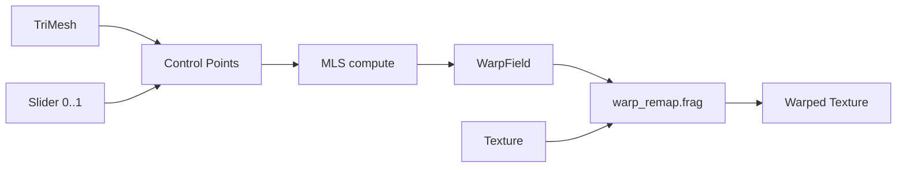

# Warp Engine

## Objetivo

Motor de **deformação geométrica** independente da UI e dos filtros individuais.

## Localização

`lib/features/editor/beauty_engine/warp/`

## Implementação inicial: Moving Least Squares (MLS)

MLS deforma imagem baseado em pares **source → target** control points derivados dos landmarks + intensidade do slider.

```
warp/
├── models/
│   ├── control_point.dart
│   ├── warp_field.dart
│   └── warp_request.dart
├── mls_warp_engine.dart       # implementação MLS (default)
├── tps_warp_engine.dart       # stub Sprint futuro
├── arap_warp_engine.dart      # stub Sprint futuro
├── mesh_warp_engine.dart        # stub Sprint futuro
└── warp_engine.dart           # interface + factory
```

## Interface extensível

```dart
enum WarpAlgorithm { mls, thinPlateSpline, arap, meshWarp }

abstract class WarpEngine {
  WarpAlgorithm get algorithm;
  WarpField compute(WarpRequest request);
  Future<TextureHandle> applyGPU(
    TextureHandle input,
    WarpField field,
    GPURenderer renderer,
  );
}
```

## WarpRequest

```dart
class WarpRequest {
  final TriMesh mesh;
  final MeshRegion region;
  final Map<String, double> parameters; // e.g. face_slim: 0.35
  final Size imageSize;
}
```

## MLS — fluxo

1. Filter define control points (ex: jaw landmarks → inward offset proporcional a `face_slim`)
2. MLS calcula campo de deslocamento por pixel ou por vertex
3. GPU aplica via shader de remap (`shaders/warp_remap.frag`)

## Preparação TPS / ARAP

- `WarpEngineFactory.create(WarpAlgorithm.thinPlateSpline)` retorna `UnimplementedError` até sprint dedicado
- Mesma interface `WarpRequest` / `WarpField` — filtros não mudam

## Diagrama



## Performance

- Preferir warp **por vertex + GPU raster** vs per-pixel CPU
- Limitar resolução de campo MLS em preview; full res no export

## Riscos

| Risco | Mitigação |
|-------|-----------|
| Artefatos em bordas | Máscara feather por região |
| Background distorce | Máscara limitada à região mesh |
| MLS lento em 12MP | Downsample preview; full res export |
