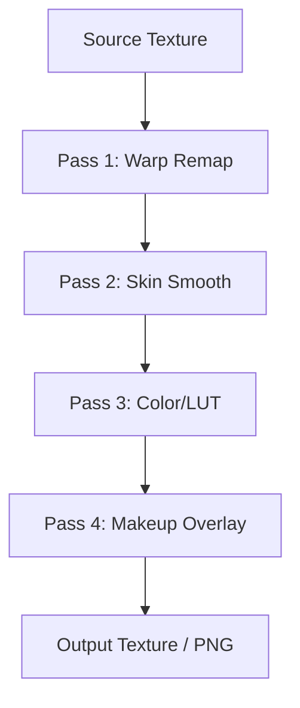

# GPU Rendering

## Objetivo

Renderizar preview e export **no GPU**, evitando pipelines CPU para warp, LUT, skin e composição.

## Localização

`lib/features/editor/beauty_engine/rendering/`

## Stack

| Camada | Tecnologia |
|--------|------------|
| Flutter | Impeller (default iOS/Android modernos) |
| Shaders | GLSL → SPIR-V (via flutter_image_filters patterns) |
| API | Flutter GPU / `dart:ui` Picture + custom FragmentProgram |
| Fallback | OpenGL ES 3.0 (Android), Metal (iOS) |

## Pipeline de render



## Componentes

```
rendering/
├── gpu_renderer.dart
├── texture_handle.dart
├── render_target.dart
├── shader_program_cache.dart
├── pass_warp.dart
├── pass_skin.dart
├── pass_lut.dart
├── pass_makeup.dart
└── export_encoder.dart    # texture → JPEG/PNG bytes
```

## Shaders (`beauty_engine/shaders/`)

| Shader | Função |
|--------|--------|
| `warp_remap.frag` | Aplicar WarpField |
| `bilateral_skin.frag` | Skin smooth (edge-preserving) |
| `lut_apply.frag` | LUT 3D/2D |
| `whitening.frag` | Skin whitening |
| `makeup_blend.frag` | Blush, lipstick, contour |

## Integração Manual Editor

Fase 1 Manual Editor usa `flutter_image_filters` para LUT — **mantido**.

Beauty Engine adiciona renderer próprio para warp + skin; LUT pass pode delegar ao mesmo backend SPIR-V.

## Targets de performance

| Cenário | Target |
|---------|--------|
| Preview selfie 720p | ≥ 24 FPS |
| Preview foto 12MP | ≥ 8 FPS ou tile-based |
| Export 12MP | < 3s mid-range |

## Plataformas (somente nativo)

Target exclusivo: **iOS + Android**. Sem Web/Desktop.

| Plataforma | GPU Path |
|------------|----------|
| **Android** | Impeller / OpenGL ES (Vulkan interno via Impeller quando disponível) |
| **iOS** | Impeller / Metal |

## Riscos

- Flutter GPU API ainda evolui — abstrair behind `GPURenderer` interface
- Memória textura 12MP — pool + release após export
