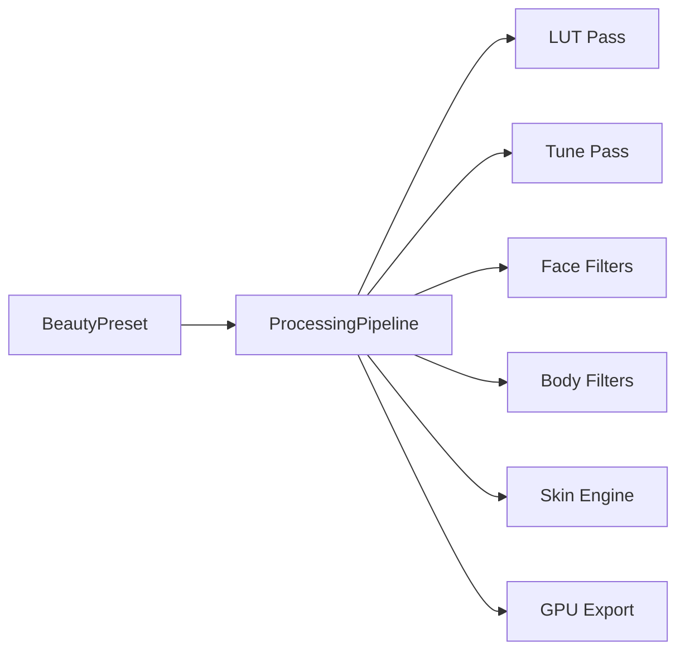

# Sistema de Presets

## Dois tipos de filtros

### 1. LUT Presets (Lightroom-style)

- Arquivos PNG square/HALD lookup table
- Processados via `flutter_image_filters` (Manual Editor) e `pass_lut` (Beauty Engine)
- Curados: Vintage, Film, B&W, etc.

### 2. Beauty Presets (compostos)

Presets nomeados que combinam múltiplos parâmetros:

| Preset | Combinação típica |
|--------|-------------------|
| Natural | LUT suave + skin smooth leve |
| Instagram | LUT warm + contraste + face slim leve |
| Influencer | LUT vivid + face slim + eye scale + skin smooth |
| Beauty | skin smooth + whitening + face slim + nose slim |
| Wedding | LUT soft + skin + teeth whiten |
| Studio | LUT neutral + contraste + cheekbone |
| Soft | desaturação + skin smooth |
| Cinema | LUT teal/orange + vignette |

## Modelo de dados

```dart
class BeautyPreset {
  final String id;
  final String name;
  final String? lutAssetPath;
  final TuneParams tune;           // brightness, contrast, saturation, temperature
  final FaceParams face;           // face_slim, nose_slim, eye_scale, ...
  final BodyParams body;           // waist, legs, arms, ...
  final SkinParams skin;           // smooth, whitening, acne, wrinkles
  final MakeupParams? makeup;      // blush, lips, contour, eyebrows
  final int version;
  final String? authorId;
  final DateTime createdAt;
}
```

## CRUD e persistência

| Operação | Onde |
|----------|------|
| Criar preset | UI Criador (Sprint 22) → JSON local |
| Editar preset | Criador → merge params |
| Salvar preset | Hive/local + Supabase (Sprint 23) ✅ |
| Importar | JSON file / clipboard |
| Exportar | JSON file share |
| Sincronizar | Supabase `beauty_presets` table (Sprint 23) ✅ |
| Compartilhar | Marketplace (Sprint 24) ✅ |

## Supabase (Sprint 23)

Nova tabela proposta:

```sql
CREATE TABLE beauty_presets (
  id uuid PRIMARY KEY DEFAULT gen_random_uuid(),
  user_id uuid REFERENCES users(id),
  name text NOT NULL,
  preset_json jsonb NOT NULL,
  is_public boolean DEFAULT false,
  thumbnail_url text,
  created_at timestamptz DEFAULT now(),
  updated_at timestamptz DEFAULT now()
);
```

RLS: user owns row; public presets readable by all authenticated.

## Integração pipeline



## Manual Editor (Fase 1)

Manual Editor usa apenas **LUT Presets** via `filter_presets.dart` — inalterado.

Beauty Presets completos entram com Beauty Engine (Sprint 21+).
