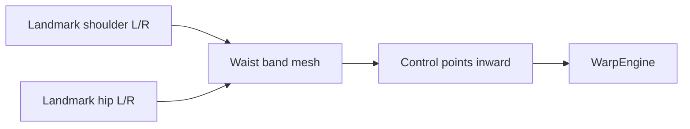

# Filtros Corporais — Roadmap

Implementados em `beauty_engine/filters/body/`, dependem de **MediaPipe Pose** + **Body Mesh**.

## Lista completa

| ID | Nome | Landmarks base | Sprint |
|----|------|----------------|--------|
| `waist_slim` | Waist Slim | ombros + quadril | 18 |
| `hip` | Hip | quadril (23, 24) | 18 |
| `leg_length` | Leg Length | quadril → tornozelo | 19 |
| `leg_slim` | Leg Slim | coxa + panturrilha | 19 |
| `arm_slim` | Arm Slim | ombro → pulso | 20 |
| `neck_slim` | Neck Slim | queixo → ombros | 20 |
| `shoulder_width` | Shoulder Width | 11, 12 | 20 |
| `body_slim` | Body Slim | torso mesh global | 18 |
| `head_size` | Head Size | face bbox + scale | 20 |

## Desafios específicos

| Desafio | Mitigação |
|---------|-----------|
| Pose parcial (só busto) | Detectar visibility; ocultar sliders body |
| Background warp | Máscara silhueta + inpainting leve futuro |
| Roupa distorce | Limitar warp magnitude; warning UX |
| Mãos na cintura | Landmark visibility check |

## Dependências

- Sprint 04 MediaPipe Pose
- Sprint 05 Mesh Engine (body regions)
- Sprint 06 Warp Engine

## Diagrama região waist

