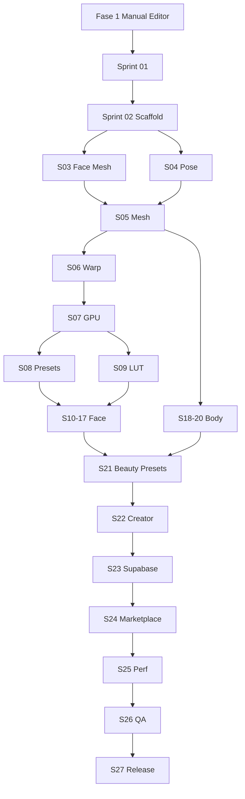

# Roadmap — Fases e Dependências

## Fase 1 — Manual Editor (ENTREGA ATUAL)

**Duração:** ~10–14 dias  
**Status:** ✅ Concluída (2026-07-20) — [sign-off](./fase-1-manual-editor-signoff.md)

Conteúdo inalterado:
- pro_image_editor + flutter_image_filters
- LUTs, crop, rotação, ajustes
- Supabase `manual_edit`, Edge Function, 0 créditos, limite unificado `max_stored_photos`
- `/comparison` + download

Ver plano principal: [`editor_manual_meitu_19741884.plan.md`](../../.cursor/plans/editor_manual_meitu_19741884.plan.md)

---

## Fase 2 — Beauty Engine Foundation (Sprints 01–09)

| Sprint | Entrega | Depende de |
|--------|---------|------------|
| 01 | Revisão arquitetura | Fase 1 shipped |
| 02 | Scaffold beauty_engine/ | 01 |
| 03 | MediaPipe Face Mesh | 02 |
| 04 | MediaPipe Pose | 02 |
| 05 | Mesh Engine | 03, 04 |
| 06 | Warp Engine (MLS) | 05 |
| 07 | GPU Rendering | 06 |
| 08 | Preset system (models) | 07 |
| 09 | LUT Engine unificado | 07, 08 | ✅ |

---

## Fase 3 — Face Filters (Sprints 10–17)

| Sprint | Filtros |
|--------|---------|
| 10 | Face slim, narrow, V face ✅ |
| 11 | Nose (all) ✅ |
| 12 | Eyes (all) ✅ |
| 13 | Jaw + chin ✅ |
| 14 | Cheekbone ✅ |
| 15 | Forehead + temple ✅ |
| 16 | Lips + mouth + smile ✅ |
| 17 | Skin engine + makeup ✅ |

---

## Fase 4 — Body Filters (Sprints 18–20)

| Sprint | Filtros |
|--------|---------|
| 18 | Waist, hip, body slim ✅ |
| 19 | Leg length, leg slim ✅ |
| 20 | Arm, neck, shoulder, head size ✅ |

---

## Fase 5 — Presets & Platform (Sprints 21–27)

| Sprint | Entrega |
|--------|---------|
| 21 | Beauty Presets bundled ✅ |
| 22 | Preset Creator UI ✅ |
| 23 | Supabase sync |
| 24 | Marketplace (MVP) |
| 25 | Performance hardening |
| 26 | QA matrix |
| 27 | Release ✅ |

---

## Diagrama dependências

## Estimativa grossa

| Fase | Sprints | Duração estimada |
|------|---------|------------------|
| Fase 1 Manual Editor | — | 2–3 semanas |
| Fase 2 Foundation | 01–09 | 8–12 semanas |
| Fase 3 Face | 10–17 | 8–10 semanas |
| Fase 4 Body | 18–20 | 3–4 semanas |
| Fase 5 Platform | 21–27 | 6–8 semanas |
| **Total Beauty Engine** | 01–27 | **~6–9 meses** |
