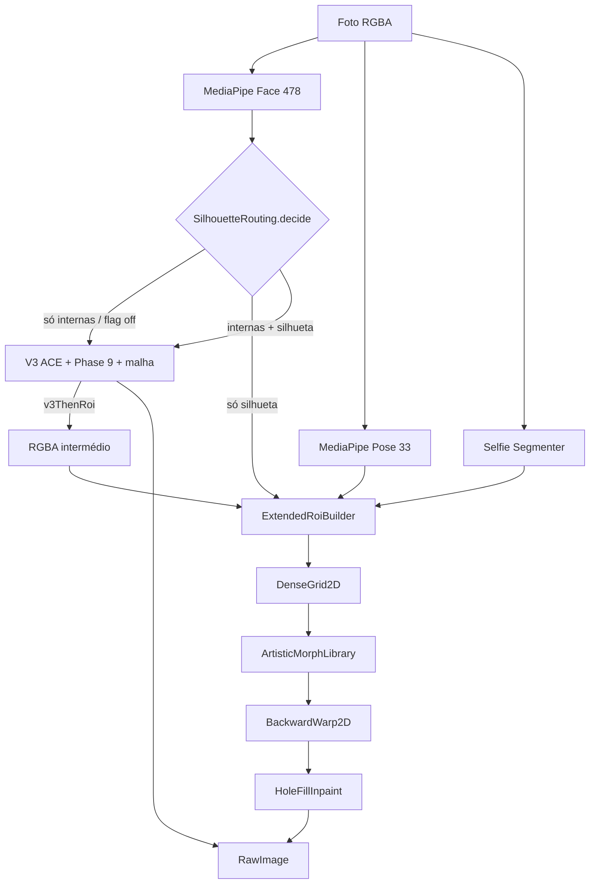

# Extended ROI + Dense Grid

**Data:** 18 de agosto de 2026  
**Estado:** Sprints 0–7 implementados. Flag `useExtendedRoi = kDebugMode` (off em release até signoff).  
**Afinar (`face_slim`):** permanece no V3 (`faceSlimUsesRoi = false`).

Caminho **paralelo** ao Face Warp V3 para tools de silhueta (`chin`, `jaw`, `v_face`). Unidade de deformação: ROI da foto (cara + pescoço + fundo imediato), grelha densa 2D. Não substitui ACE / malha 468 / Phase 9.

Documento irmão: [`31-sistema-facial-atual.md`](./31-sistema-facial-atual.md).

---

## Resumo

O V3 falha em queixo/mandíbula porque o raster só pinta o interior da malha MediaPipe e o `GeometricSupport` atenua o oval. O Extended ROI deforma a **borda da foto** e preenche o buraco.

| Tool | Caminho | Amplitude @ t=1, scale 0.5 |
|---|---|---|
| `chin` | ROI | lift 4% faceH |
| `jaw` | ROI | 3% faceW, só Δx |
| `v_face` | ROI | jaw×1.0 + chin×0.45 |
| `face_slim` | **V3** | A/B Sprint 5: ROI perde naturalidade |
| internas (`cheekbone`, nariz, olhos, boca) | V3 | mix Sprint 6 se silhueta também activa |

---

## Arquitectura

Resolução da grelha: preview 64×80; export 80×100; fallback 48×60. Preview downscale 0.5× se a ROI for mais alta que 800 px.

---

## Componentes

Pasta: `lib/features/editor/beauty_engine/warp/extended_roi/`

| Ficheiro | Papel |
|---|---|
| `extended_roi_builder.dart` | Oval + pescoço + person mask → rect + domain |
| `dense_grid_2d.dart` | Campo dx/dy/weight, index `j * cols + i` |
| `artistic_morph_library.dart` | Único autor do campo ROI |
| `artistic_morphs/chin_shortening.dart` | Queixo |
| `artistic_morphs/jaw_narrow.dart` | Mandíbula |
| `artistic_morphs/v_face.dart` | Composição aditiva |
| `artistic_morphs/face_slim_roi.dart` | A/B Sprint 5; **não ligado** |
| `backward_warp_2d.dart` | Remap 1 iter Newton |
| `hole_fill_inpaint.dart` | Clone pescoço + NN |
| `phase9_local.dart` | Log only (`enabled=false`) |
| `silhouette_routing.dart` | `identity` / `v3Only` / `roiOnly` / `v3ThenRoi` |
| `extended_roi_metrics.dart` | Silhueta, ghost, boca, fundo, proxy 1–5 |
| `rgba_scale.dart` | Down/up bilinear do preview |

Wiring: `BeautyEngineController.composeFaceField` + `PassWarp` (V3 primeiro, ROI em cima no mix).

---

## Métricas (Sprint 7, `amplitudeScale = 0.5`)

Alvos do plano vs resultado no dataset (mediana @ chin t=1, salvo nota):

| Métrica | Alvo | Resultado | Estado |
|---|---|---|---|
| Silhueta chin | ≥ 4% faceH @ t=1 (≥ 3% @ t=0.5) | **4.6%** @ t=1; **4.0%** @ t=0.5 | OK |
| Ghost residual | < 0.2 | mediana **0.184**; p05 **0.225**, p06 **0.242** | parcial |
| Boca | < 0.5 px | **0.00 px** | OK |
| Fundo | < 1.5 px | **0.18–0.70 px** | OK |
| Naturalidade | ≥ 3.0 @ t=0.5 e t=1 | proxy 3.4–4.1; **visual ~2** (smear no bordo) | falha visual |
| Performance p50 | < 500 ms | **140 ms** compose+render | OK |

O proxy de naturalidade (SSIM + invariantes) **não substitui** a nota 1–5 no simulador. O bordo do queixo continua com ghost/smear — por isso a amplitude **não sobe**.

---

## Fotos de validação

Cinco reais com landmarks em cache + três derivados de p01 (yaw ~20°, pitch/queixo alto, fundo com linhas). Barba dedicada sem JSON de landmarks — não entrou.

chin @ **t=1**, scale 0.5:

| Foto | Silhueta %faceH | Ghost | Boca px | Fundo px | SSIM | Nat. proxy |
|---|---:|---:|---:|---:|---:|---:|
| real-p01 (homem) | 4.61 | 0.182 | 0.000 | 0.665 | 0.978 | 4.10 |
| real-p05 (mulher) | 4.59 | 0.225 | 0.000 | 0.444 | 0.990 | 3.40 |
| real-p06 (senior) | 4.62 | 0.242 | 0.000 | 0.200 | 0.996 | 3.40 |
| real-p12 (oval) | 4.58 | 0.170 | 0.000 | 0.538 | 0.994 | 4.10 |
| real-p21 (square-jaw) | 4.59 | 0.193 | 0.000 | 0.588 | 0.991 | 4.10 |
| yaw_20deg | 4.61 | 0.184 | 0.000 | 0.695 | 0.979 | 4.10 |
| pitch_chin_high | 4.61 | 0.184 | 0.000 | 0.665 | 0.978 | 4.10 |
| fundo_linhas | 4.61 | 0.118 | 0.000 | 0.665 | 0.965 | 4.10 |

Tabela completa (t=0.5 e t=1): `.cursor/extended-roi/sprint7/metrics.md`. Crops: `.cursor/extended-roi/sprint7/*_chin1_crop.png`.

---

## Decisões

- **`face_slim`:** não migrar. A/B Sprint 5: ROI mexe mais a bochecha e o bordo, mas o smear perde para o V3 (naturalidade visual).
- **`amplitudeScale`:** **fica 0.5**. Ghost mediana 0.184; p05/p06 > 0.2; smear visível no queixo. Subir para 0.75 ou 1.0 aumentaria o artefacto. Reavaliar só depois do hole-fill.
- **`Phase9Local`:** off. `foldCellCount` ~12 no p01; inpaint cobre. Não ligar o solver.
- **`useExtendedRoi`:** `kDebugMode`. Release off até signoff.
- **`singleRemap`:** não implementado. Mix Sprint 6 é sequencial (V3 → ROI). Só se SSIM(sequential, fused) < 0.98.

---

## Critérios M1 (queixo)

- Silhueta do queixo **visível** nas âncoras (≥ 3% faceH @ t=0.5, ≥ 4% @ t=1).
- Boca e fundo dentro do alvo.
- Qualidade de bordo **ainda abaixo** de Meitu (smear). Produto lab: Queixo no editor com overlay; não é release.

---

## Próximos passos

- Melhorar hole-fill / bordo (ghost p05/p06, smear p01) **antes** de subir `amplitudeScale`.
- `narrow_face` / `cheeks_jaw` (Sprint 8+).
- `singleRemap` no export se o harness de blur medir SSIM < 0.98.
- Signoff visual 1–5 no simulador (Leonardo) nas três âncoras p01 / p05 / p12.
